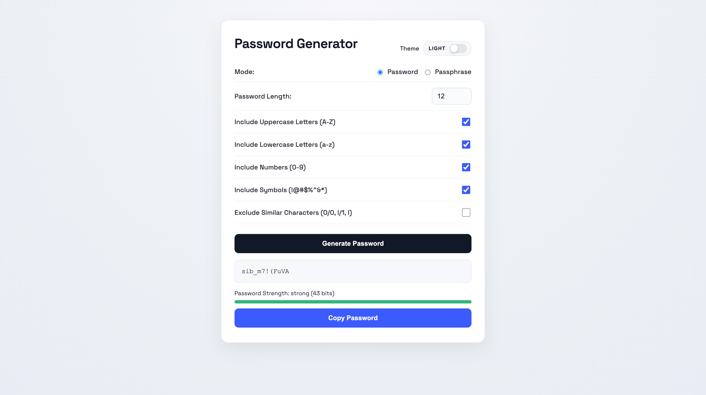

# Password Generator

A client-side password and passphrase generator with theme toggle, strength meter, and copy support.

## Features
- Custom length (4-50) with guaranteed inclusion of selected character types
- Uppercase, lowercase, numbers, symbols toggles
- Exclude similar characters (O/0, l/1, I)
- Passphrase mode (word list, 2–10 words, separator: random, `-`, `.`, `_`, space)
- Strength indicator (heuristic)
- Entropy estimate (bits, based on unique characters in the generated password)
- Copy to clipboard with cooldown and toast feedback
- Light/dark theme toggle
- Keyboard shortcuts (Enter = generate, Ctrl/Cmd + C = copy)
- Cryptographically secure randomness via `crypto.getRandomValues`
- Remembers theme preference with localStorage
- Auto-generates a password on page load

## How to Use
1. Choose a mode: Password or Passphrase.
2. Set the length (or word count for passphrases).
3. Toggle character types and optional exclude-similar.
4. Click **Generate Password**.
5. Click **Copy Password** (or press Ctrl/Cmd + C).

## Run
Open `index.html` in your browser.

## Notes
- Passwords are generated locally in the browser.
- If you select multiple character types, length must be at least the number of selected types.

## Files
- `index.html`
- `style.css`
- `script.js`
